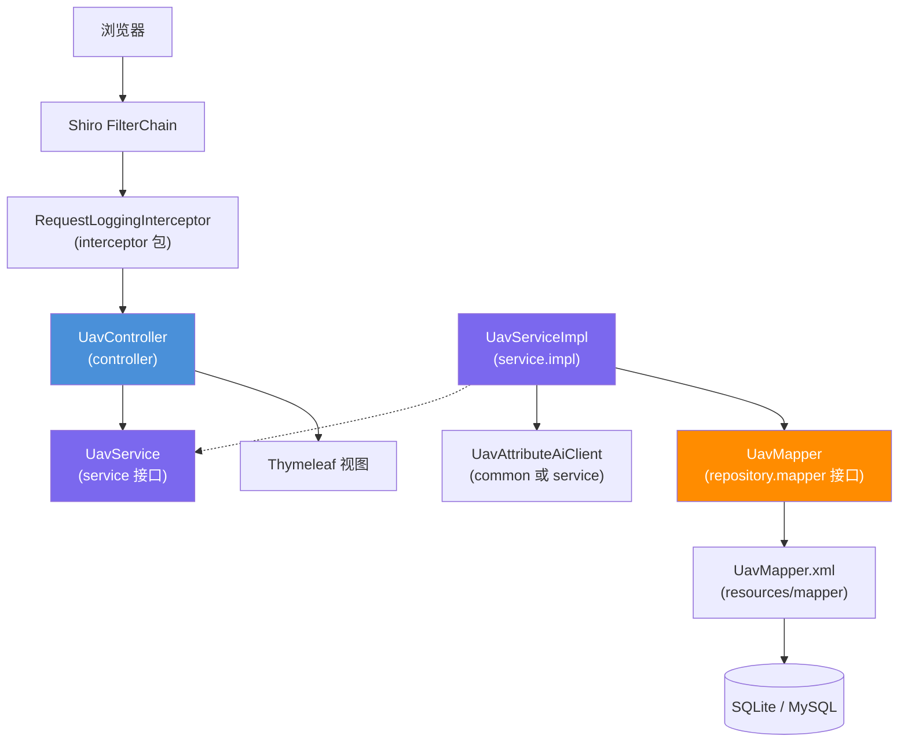

# 无人机信息管理 技术设计文档

**关联需求**：[无人机信息管理需求](../01-product-specs/uav-management-spec.md)  
**文档状态**：已确认  
**创建时间**：2026-05-06  
**最后更新**：2026-05-06  
**负责人**：待定

---

## 概述

采用 **Spring MVC + Thymeleaf + Bootstrap** 提供页面态 CRUD；**Apache Shiro** 负责认证与授权；**MyBatis** 承担持久化，**Druid** 管理数据源。业务上通过独立 **AI 客户端**根据用户输入生成无人机扩展属性（JSON 存储）。服务接口与实现分属不同包；数据访问以 Mapper 接口 + XML 映射实现「接口与映射实现分离」；HTTP 层使用独立包存放 **HandlerInterceptor**，统一打印请求摘要日志并与 Shiro 过滤器链协同。

目标运行时栈与版本约束：**Java EE 8 / Servlet 3.0、Maven 3、Spring Boot 2.2.x、Spring Framework 5.2.x、Apache Shiro 1.7、MyBatis 3.5.x、Hibernate Validator 6.0.x、Alibaba Druid 1.2.x、Thymeleaf 3.0.x、Bootstrap 3.3.7**。数据库默认 **SQLite**，通过 Profile/配置切换 **MySQL**。

---

## 架构设计

### 组件关系图



说明：`domain` 存放实体与表单/DTO；`repository.mapper` 仅放 Mapper 接口；MyBatis XML 位于 `resources/mapper`，视为数据访问映射实现，符合「接口与实现分离」约定。

### 数据流向

**请求处理流程**：

1. 浏览器请求到达 Servlet 容器，经 **Shiro** 过滤器完成认证/授权。
2. **RequestLoggingInterceptor** 记录请求方法、URI、查询串、可选 requestId（及对敏感头的脱敏摘要）。
3. **UavController** 接收表单或查询参数，使用 `@Valid` 校验 **Command/DTO**。
4. **UavService**（实现类 `UavServiceImpl`）编排事务：必要时调用 **AI 客户端**生成属性 JSON，再调用 **UavMapper** 完成插入/更新/删除/查询。
5. Mapper 与数据库交互，返回 **domain** 实体。
6. Controller 将模型数据交给 Thymeleaf 渲染或使用 redirect flash 传递消息。

**异常处理流程**：

1. Service 抛出业务异常（如重复机身编号）；全局 **`@ControllerAdvice`**（或错误页）统一转换为友好提示。
2. AI 超时/异常：捕获后执行降级策略（保存非 AI 字段，标记 `aiGenerationStatus`），页面展示告警。

---

## 包结构约定（节选）

| 包路径（示例） | 职责 |
|----------------|------|
| `...controller` | Spring MVC 控制器 |
| `...service` | `UavService` 接口 |
| `...service.impl` | `UavServiceImpl` |
| `...repository.mapper` | MyBatis `UavMapper` 接口 |
| `...domain` | `Uav` 实体、表单对象 |
| `...interceptor` | `HandlerInterceptor` 实现（请求日志等） |
| `...config` | Shiro、MyBatis、Interceptor 注册 |

---

## 接口定义（HTTP / 页面）

首期以 **服务端渲染**为主（与 Bootstrap + Thymeleaf 一致）。REST JSON 可作为后续扩展；本文档冻结页面流接口如下。

**上下文路径**：假设应用部署为 `/`，下列路径均为相对应用的 servlet path。

| 方法 | 路径 | 描述 | Shiro |
|------|------|------|--------|
| GET | `/uavs` | 分页列表（支持 `keyword`、`page`、`size`） | `authc` + 查询权限 |
| GET | `/uavs/new` | 新建表单页 | `authc` + 新增权限 |
| POST | `/uavs` | 提交新建 | `authc` + 新增权限 |
| GET | `/uavs/{id}` | 详情 | `authc` + 查询权限 |
| GET | `/uavs/{id}/edit` | 编辑表单 | `authc` + 编辑权限 |
| POST | `/uavs/{id}` | 提交更新（可用 `_method=put` 隐藏域由过滤器改写，依项目统一约定） | `authc` + 编辑权限 |
| POST | `/uavs/{id}/delete` | 删除 | `authc` + 删除权限 |

**查询参数（列表）**：

| 参数 | 类型 | 必填 | 说明 |
|------|------|------|------|
| keyword | String | 否 | 匹配机身编号、型号、备注 |
| page | int | 否 | 页码，从 1 开始，默认 1 |
| size | int | 否 | 每页条数，默认 10 |

---

## AI 生成契约（逻辑字段）

**输入（服务端组装）**：机身编号 `frameSn`、型号 `modelName`、可选用户备注 `notes`。

**输出**：结构化 JSON，建议字段包括但不限于：`maxFlightTimeMinutes`、`maxPayloadKg`、`diagonalSizeMm`、`cameraMount`、`communicationLink`、`extraNotes`（均为可选，以实际对接模型为准）。

**存储**：数据库中以单列 **`ai_attributes`（TEXT/JSON）** 存储序列化后的 JSON；另设 **`ai_generation_status`**（枚举：SUCCESS、FAILED、SKIPPED）与 **`ai_last_error`**（截断文本）便于排查。

**超时与重试**：默认超时可配置（如 15s）；失败时不阻断整单保存（与需求一致），仅标记状态。

---

## 数据模型

### 实体 `Uav`（表：`uav`）

| 字段名 | Java 类型 | 数据库类型 | 约束 | 说明 |
|--------|-----------|------------|------|------|
| id | Long | BIGINT / INTEGER | PK，自增 | 主键；SQLite 用 INTEGER AUTOINCREMENT |
| frameSn | String | VARCHAR(64) | NOT NULL, UNIQUE | 机身编号 |
| modelName | String | VARCHAR(128) | NOT NULL | 型号 |
| notes | String | VARCHAR(512) | NULL | 备注 |
| aiAttributes | String | TEXT / JSON | NULL | AI 生成属性 JSON |
| aiGenerationStatus | enum/String | VARCHAR(32) | NOT NULL | SUCCESS/FAILED/SKIPPED |
| aiLastError | String | VARCHAR(512) | NULL | 最近一次 AI 错误摘要 |
| createdAt | LocalDateTime | DATETIME | NOT NULL | 创建时间 |
| updatedAt | LocalDateTime | DATETIME | NOT NULL | 更新时间 |

### SQLite 建表示例

```sql
CREATE TABLE uav (
    id INTEGER PRIMARY KEY AUTOINCREMENT,
    frame_sn VARCHAR(64) NOT NULL UNIQUE,
    model_name VARCHAR(128) NOT NULL,
    notes VARCHAR(512),
    ai_attributes TEXT,
    ai_generation_status VARCHAR(32) NOT NULL,
    ai_last_error VARCHAR(512),
    created_at DATETIME NOT NULL,
    updated_at DATETIME NOT NULL
);
CREATE INDEX idx_uav_model ON uav(model_name);
```

### MySQL 建表示例

```sql
CREATE TABLE uav (
    id BIGINT NOT NULL AUTO_INCREMENT PRIMARY KEY,
    frame_sn VARCHAR(64) NOT NULL,
    model_name VARCHAR(128) NOT NULL,
    notes VARCHAR(512),
    ai_attributes JSON,
    ai_generation_status VARCHAR(32) NOT NULL,
    ai_last_error VARCHAR(512),
    created_at DATETIME NOT NULL,
    updated_at DATETIME NOT NULL,
    UNIQUE KEY uk_uav_frame_sn (frame_sn),
    KEY idx_uav_model (model_name)
) ENGINE=InnoDB DEFAULT CHARSET=utf8mb4;
```

方言差异：列表关键字查询在 MyBatis XML 中使用 `<bind>` 或数据库无关的模糊拼接；若必须使用函数，可用 `<choose>` 按 `databaseId` 分支。

---

## 数据库切换

- **方式**：Spring Profile，例如 `sqlite`（默认）、`mysql`。
- **配置**：`application-sqlite.yml` 指定 SQLite JDBC URL、`spring.datasource`、MyBatis `databaseIdProvider`（可选）。
- **初期**：开发与环境默认启用 `sqlite`；生产切换 `mysql` 时同步执行建表脚本。

---

## 拦截器与日志

- **类名建议**：`RequestLoggingInterceptor`，位于 **`...interceptor`** 包。
- **注册**：在 WebMvcConfigurer 中 `addInterceptors`，顺序在 Shiro 之后仍能拿到主体信息时可记录登录用户 id（注意避免敏感数据）。
- **日志内容**：HTTP 方法、requestURI、queryString、`X-Request-Id`（若前端传入则透传，否则生成 UUID）、耗时（可在 afterCompletion 打）。
- **脱敏**：禁止完整打印 Cookie、`Authorization`、密码字段。

---

## 技术选型

| 技术 | 版本（目标） | 用途 | 选择理由 |
|------|----------------|------|----------|
| Spring Boot | 2.2.x | 应用骨架 | 与现行约定一致 |
| Spring Framework | 5.2.x | MVC / 事务 | 与 Boot 2.2 对齐 |
| Apache Shiro | 1.7 | 安全 | 需求指定 |
| MyBatis | 3.5.x | ORM 映射 | 需求指定，SQL 可控 |
| Hibernate Validator | 6.0.x | 参数校验 | 与 Bean Validation 2.0 配套 |
| Druid | 1.2.x | 连接池与监控 | 需求指定 |
| Thymeleaf | 3.0.x | 模板 | 服务端渲染 |
| Bootstrap | 3.3.7 | UI | 需求指定 |

---

## 风险与注意事项

### 技术风险

| 风险 | 影响程度 | 概率 | 应对策略 |
|------|----------|------|----------|
| AI 服务不稳定 | 中 | 中 | 超时、降级、状态字段、可重试编辑 |
| SQLite 与 MySQL SQL 差异 | 中 | 中 | MyBatis databaseId、避免原生方言混杂 |
| Shiro 与 Spring Boot 2.2 集成版本边界 | 低 | 低 | 锁定依赖版本，集成测试覆盖登录流程 |

### 注意事项

1. **事务边界**：创建/更新应在同一事务中写入业务表；AI 调用建议不在长事务内阻塞（可先调用 AI 再开短事务，或先保存草稿再异步，具体以实现权衡）。
2. **线程安全**：Druid 与 SqlSessionFactory 单例；拦截器无实例变量保存请求状态。
3. **本仓库父 POM** 若使用更高版本 Spring Boot，实施模块应在子模块 POM 中显式对齐本设计所列版本，避免混用。

---

## 测试策略

| 测试类型 | 测试类（示例） | 框架 | 覆盖场景 |
|----------|----------------|------|----------|
| Service 单元测试 | `UavServiceImplTest` | Mockito + JUnit 5 | CRUD、重复编号、AI 成功/失败降级 |
| Controller 切片测试 | `UavControllerTest` | `@WebMvcTest` + `@MockBean` | 校验、重定向、权限注解（若使用） |
| Mapper 测试 | `UavMapperTest` | `@MybatisTest` 或 Testcontainers（MySQL）/ 内存 SQLite | SQL 与分页 |

集成测试（可选）：`@SpringBootTest` 覆盖 Shiro 登录后访问 `/uavs` 的全链路（少量）。

---

## 变更记录

| 版本 | 日期 | 变更内容 | 变更人 |
|------|------|----------|--------|
| v1.0 | 2026-05-06 | 初始版本 | — |
